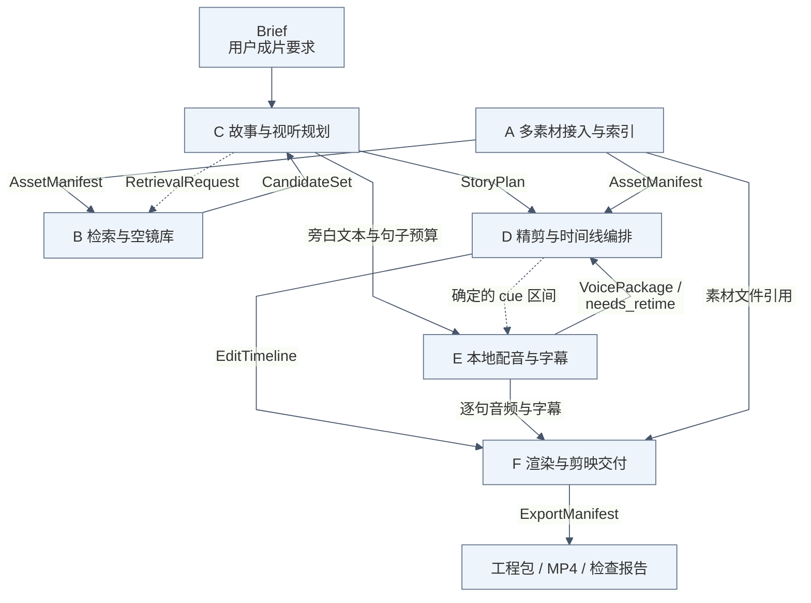

# 六人模块交付关系

实线表示主要产物交付；虚线表示检索或定时反馈。D拥有最终时间编排权，F执行导出，E提供声音事实。

```mermaid
%%{init: {"theme": "base", "htmlLabels": false, "themeVariables": {"fontFamily": "PingFang SC, Microsoft YaHei, sans-serif", "fontSize": "16px", "primaryColor": "#eef4fb", "primaryBorderColor": "#64748b", "lineColor": "#475569"}, "flowchart": {"htmlLabels": false, "wrappingWidth": 300, "curve": "linear", "nodeSpacing": 32, "rankSpacing": 44}}}%%
flowchart TB
    brief["Brief<br/>用户成片要求"] --> story["C 故事与视听规划"]
    ingest["A 多素材接入与索引"] -->|"AssetManifest"| search["B 检索与空镜库"]
    search -->|"CandidateSet"| story
    story -. "RetrievalRequest" .-> search
    story -->|"StoryPlan"| edit["D 精剪与时间线编排"]
    story -->|"旁白文本与句子预算"| voice["E 本地配音与字幕"]
    ingest -->|"AssetManifest"| edit
    voice -->|"VoicePackage / needs_retime"| edit
    edit -. "确定的 cue 区间" .-> voice
    edit -->|"EditTimeline"| render["F 渲染与剪映交付"]
    voice -->|"逐句音频与字幕"| render
    ingest -->|"素材文件引用"| render
    render -->|"ExportManifest"| package["工程包 / MP4 / 检查报告"]
```
