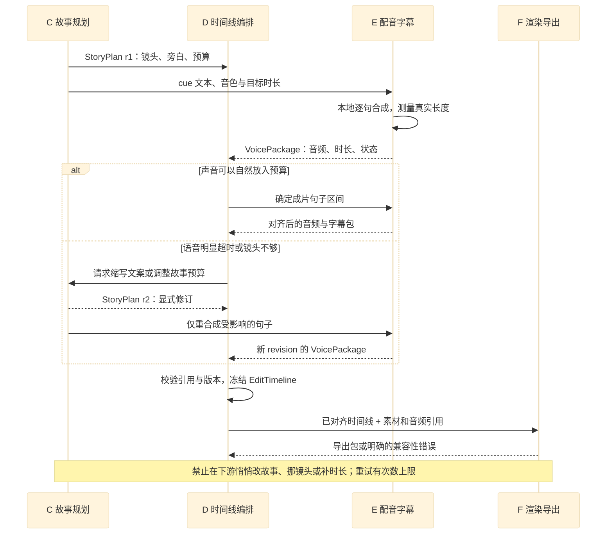

# 旁白与画面的定时反馈

设计时序：E实测声音长度，D安排成片时间，C负责内容修改。明确超出自然语速范围时重写或调整镜头，而不是任意拉伸声音。

```mermaid
%%{init: {"theme": "base", "themeVariables": {"fontFamily": "PingFang SC, Microsoft YaHei, sans-serif", "fontSize": "15px"}}}%%
sequenceDiagram
    participant C as C 故事规划
    participant D as D 时间线编排
    participant E as E 配音字幕
    participant F as F 渲染导出
    C->>D: StoryPlan r1：镜头、旁白、预算
    C->>E: cue 文本、音色与目标时长
    E->>E: 本地逐句合成，测量真实长度
    E-->>D: VoicePackage：音频、时长、状态
    alt 声音可以自然放入预算
        D->>E: 确定成片句子区间
        E-->>D: 对齐后的音频与字幕包
    else 语音明显超时或镜头不够
        D->>C: 请求缩写文案或调整故事预算
        C-->>D: StoryPlan r2：显式修订
        C->>E: 仅重合成受影响的句子
        E-->>D: 新 revision 的 VoicePackage
    end
    D->>D: 校验引用与版本，冻结 EditTimeline
    D->>F: 已对齐时间线 + 素材和音频引用
    F-->>D: 导出包或明确的兼容性错误
    Note over C,F: 禁止在下游悄悄改故事、挪镜头或补时长；重试有次数上限
```
